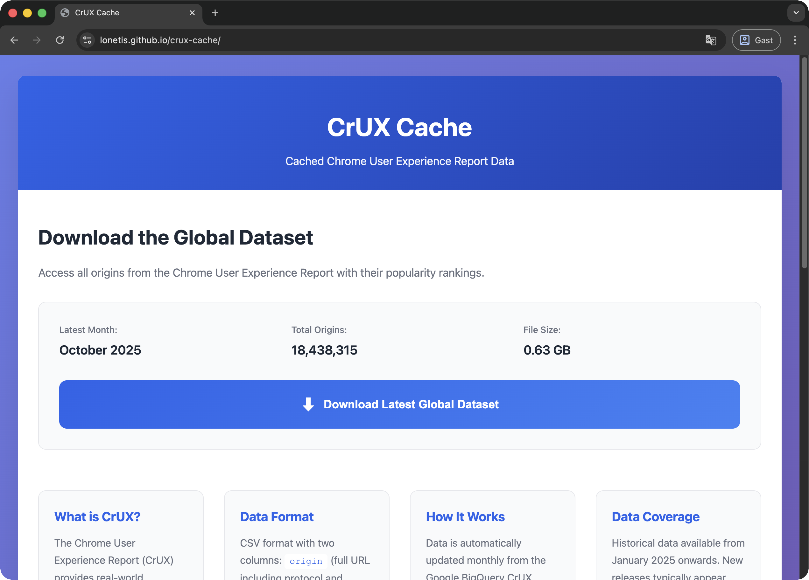

# CrUX Cache

Cached Chrome User Experience Report (CrUX) data for global and country-specific origins with popularity rankings.



## Download Data

### Option 1: Command Line (Quick & Easy)

Download datasets directly from your terminal with a single command:

```bash
# Download latest global dataset
bash <(curl -sSL https://raw.githubusercontent.com/lonetis/crux-cache/main/download.sh) global

# Download latest country-specific dataset (e.g., us, de, jp)
bash <(curl -sSL https://raw.githubusercontent.com/lonetis/crux-cache/main/download.sh) us

# Download specific month (YYYYMM format)
bash <(curl -sSL https://raw.githubusercontent.com/lonetis/crux-cache/main/download.sh) global 202510
bash <(curl -sSL https://raw.githubusercontent.com/lonetis/crux-cache/main/download.sh) us 202509
```

This will download and merge all chunks into a single CSV file (e.g., `crux_global_202510.csv` or `crux_us_202509.csv`) in your current directory.

**Available datasets:** Check [lonetis.github.io/crux-cache](https://lonetis.github.io/crux-cache) or view `data/datasets.json` for the current list of available datasets.

### Option 2: Website

Visit **[lonetis.github.io/crux-cache](https://lonetis.github.io/crux-cache)** to browse and download any dataset with a streaming browser interface

## Data Format

CSV with two columns:
- **origin**: Full URL (e.g., `https://www.google.com`)
- **rank**: Popularity bucket (1000, 10000, 100000, 1000000, etc.)

Example:
```csv
origin,rank
https://www.google.com,1000
https://www.youtube.com,1000
https://www.facebook.com,1000
```

## Dataset Details

- **Scope**: All ~18M origins tracked by CrUX
- **Updates**: Monthly (automated)
- **Format**: CSV chunks (25MB each, uncompressed)
- **Source**: [Chrome User Experience Report](https://developer.chrome.com/docs/crux) via BigQuery

## How It Works

Data is stored as chunked CSV files (25MB each) for GitHub compatibility. Only the first chunk contains a CSV header, allowing seamless concatenation.

Both download methods (CLI and website) automatically merge chunks into a single CSV file for you.

## License

MIT License - See [LICENSE](LICENSE)

CrUX data provided by Google under [CrUX Dataset Terms](https://developer.chrome.com/docs/crux)
